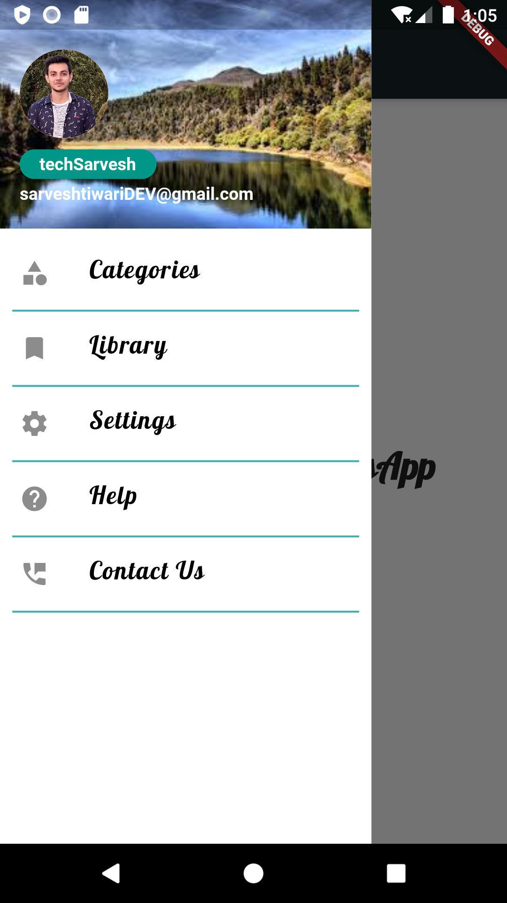
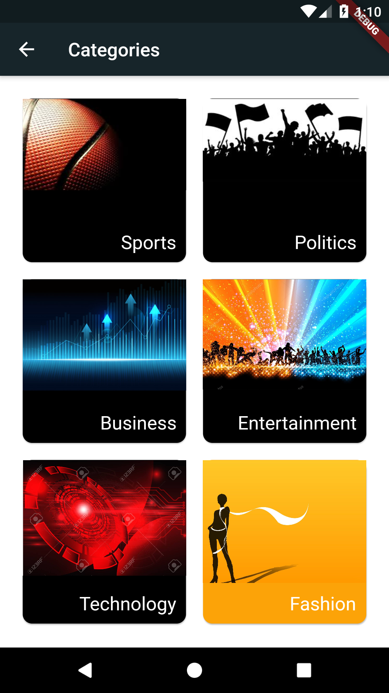
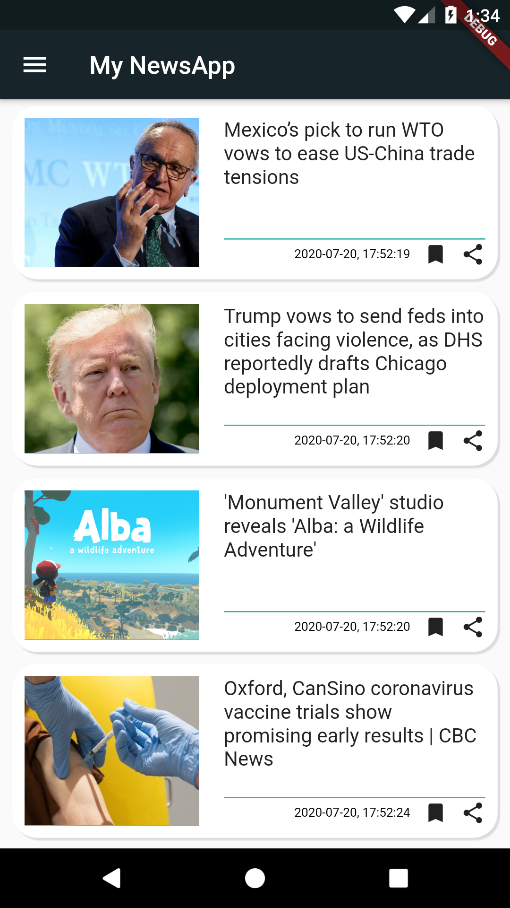

# NewsFul
This news app allows users to browse through news headlines for different categories. The preferences for the news category will be set by the user. This app also provides the feature to read out the news according to the selected preference.
-test

# framework
~ Flutter framework

## Connect with me on LinkedIn

[Join WhatsApp group](https://www.linkedin.com/in/sarvesh-nath-tiwari-5575a218a)

## *Contributors* ✨

<!-- ALL-CONTRIBUTORS-LIST:START - Do not remove or modify this section -->
<!-- prettier-ignore-start -->
<!-- markdownlint-disable -->

<table>

  <tr>
    <td align="center"><a href="https://github.com/nj1902"> <b>Sarvesh Nath Tiwari</b></a> <a href="" title="Code">💻 📖 📆 👀</a></td>
  </tr>
  
</table>
<!-- markdownlint-enable -->
<!-- prettier-ignore-end -->
<!-- ALL-CONTRIBUTORS-LIST:END -->
